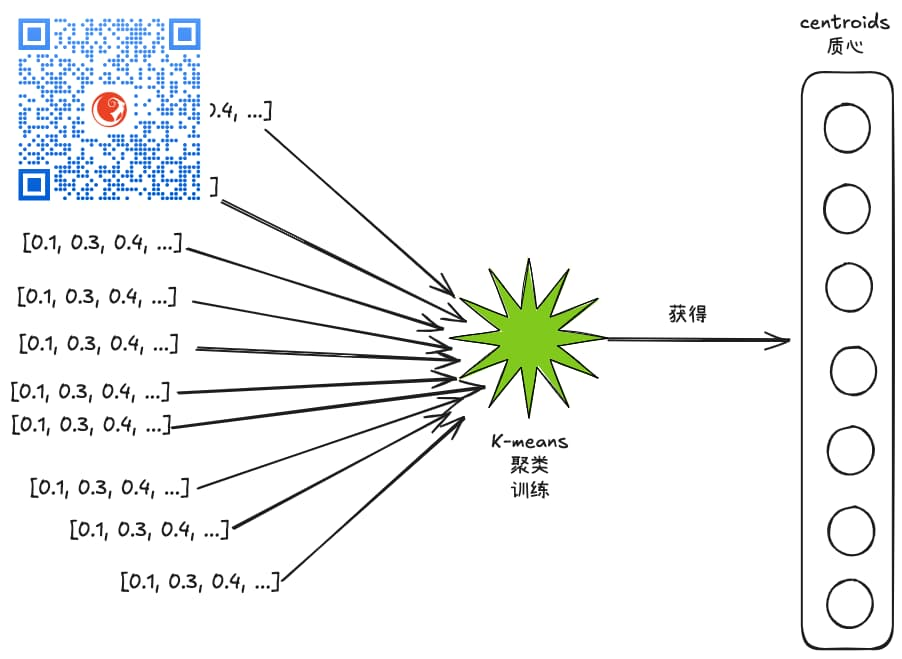
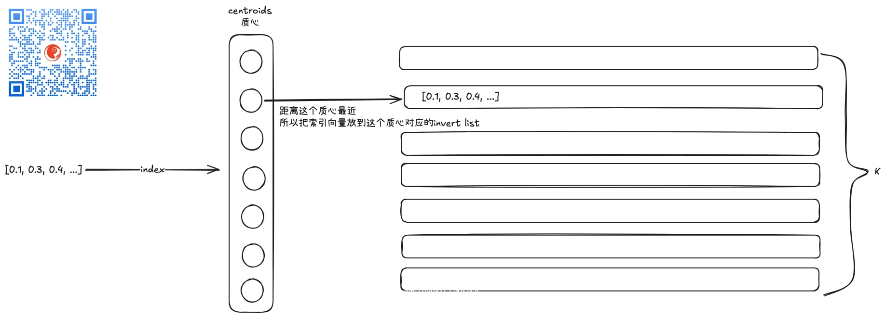
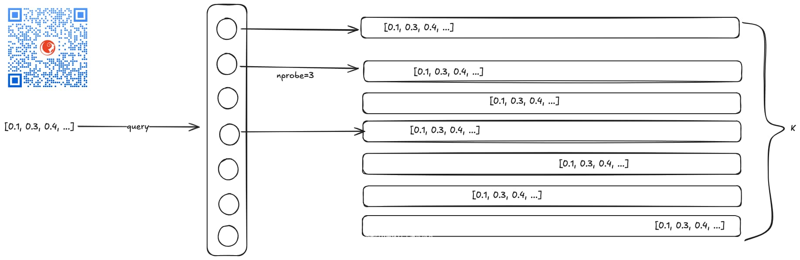

虽然KVectors向量数据库还没发布，也还没有支持IVF向量索引，但不排除我们将来会支持，所以，今天我们一起来了解下向量数据库中支持的索引类型之一： IVF向量索引。

IVF的全称是Inverted File， 它的工作原理其实说起来也挺简单的。

我不知道你有没有那种经历或者印象，就好像一个轮子在空转，你往轮子上扔泥巴也好，扔什么东西也罢，它会把你扔的东西再“分发”到其它位置🤪

好吧，扯远了

其实IVF的工作原理类似，它的第一步是要先通过k-means聚类算法对全部向量数据（或者部分，比如取10%）做一个聚类训练：

训练完成后，我们就获得了k个质心（centroids），这k个质心就相当于k个组的组长（也可以认为是k个桶的入口），后面在对向量进行索引或者查询的时候，都是基于这个训练后获得的k个质心进行的。

这个k-means训练就类似那个空转的轮子，最后把泥巴（向量数据）扔到不同的桶里。🤣

有了k个质心（centroids）之后，我们开始对向量数据进行索引：

索引的过程也很简单，来一个向量，就拿它跟k个质心（centroids）向量进行距离对比（一般基于欧几里得距离算法， 即euclidean算法），这个向量跟哪个质心最近，就把这个向量扔到哪个质心对应的“桶里”去，这个“桶”其实就是一个列表，正式名字叫inverted list。

整个索引过程就像是对向量进行分类，把它们分别放到k个桶里去。

索引构建完成后，所有的向量就都有了归属，要么属于天地会，要么属于丐帮，k大帮派，它终归得归属一个。

索引构建完成后，就可以开始查询了。

查询的过程是这样的，来一个查询向量，我们还是拿它跟k个质心先做距离计算，取n个最近的，这个n学名叫nprobe，然后在这n个桶里分别进行遍历（俗称暴力搜索，brute-force search）， 然后再把搜索结果合并之后再筛选指定数目的候选向量返回（即topK个向量）。

> k与nprobe
>
> nprobe 如果是1，最快，相当于只找一个列表里的向量；如果是k，那就相当于全量便利。 nprobe主要是为了补充提高召回率。
>
> 训练时候k参数的大小也很讲究，过大虽然查询时候更快了（list短了嘛），但召回率可能受影响（所以要配合nprobe增大）；过小（list长了），查询速度就慢了。 
> 一般的经验值是取数据集大小 N 的平方根附近，比如 4 * sqrt(N) 到 16 * sqrt(N)。对于百万级数据，k 常常设置为几千（如4096）。

原始的IVF算法学名叫IVFFlat，之所以叫这个名字因为invert list里存的是全精度向量，所以存储空间上有很大的优化空间。

这就出现了几个变种：

1. IVF-PQ，PQ是向量压缩算法，IVF-PQ其实就是用PQ对inverted list里的全精度向量进行压缩，所以，自然降低了存储，同时适用近似度计算，速度效率也会提升；
2. IVF-HNSW，HNSW也是一种向量索引，KVectors向量数据库有支持，IVF-HNSW就是在IVF的基础上，再对每个inverted list里的向量进行HNSW索引，从而在第二阶段的检索过程中进一步提升检索效率。对于极大数量量来说，这个方式很有效。inverted list很小的时候，则没有必要。

好了， 以上就是IVF的基本原理与大体情况，希望跟大家讲明白了。

哦，对了，k个质心+它们各自的inverted list组成一个inverted file，这也就是IVF名字的由来。

---

关于HNSW算法以及更多相似度算法，在企业内训课程[《如何从头设计实现一个纯Java向量数据库》](https://keevol.cn/trainings.html)中有更多探讨：

