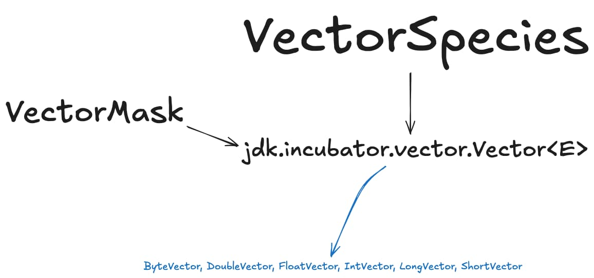

我们这里说的Java Vector API是指JEP 426， 不是java collection框架里最早的那个java.util.Vector数据结构。

Java Vector API 是Java16开始孵化的一个新特性（incubator features）， 

它允许Java充分利用支持[SIMD](/posts/SIMD.html)指令集的CPU的并行能力来提高数据计算的性能。

注意，是并行，不是并发 🤪

如果说GPU是通过SIMT，即多核心多线程来提高并行处理能力，那么， SIMD就是通过一条指令同时处理多条数据来提高并行处理能力。

Java Vector API就是为了利用SIMD来提升自己的数据计算并行处理能力而生的。

Java Vector API 的设计有三个关键类：



首先就是 VectorSpecies，它用来定义和抽象CPU寄存器的规格，也就是一次提交多少数据给CPU处理比较好。

它有三个关键属性：

1. ETYPE，即每个lane的数据类型；（lane可以理解为组成Vector的一系列slot或者说基本单元）
2. VLENGTH，即当前Vector的长度，换句话说就是有多少个lane，也就是lane的数量（count）
3. SHAPE，这个就是寄存器相关基本信息，比如多少bit位

有了 VectorSecies 作为Vector的定义规格和标准，我们就可以定义Vector，Java Vector API基于一个Vector类型给出了多种特定的Vector实现，即：

- ByteVector
- IntVector
- LongVector
- ShortVector
- FloatVector
- DoubleVector

这些具体类都有相应的util方法快速获取对应他们的VectorSpecies，比如：

```java
import jdk.incubator.vector.IntVector;
import jdk.incubator.vector.VectorSpecies;

public class LaneExampleAdd {
    public static void main(String[] args) {
        int[] a = {1, 2, 3, 4, 5, 6, 7, 8};
        int[] b = {10, 20, 30, 40, 50, 60, 70, 80};
        int[] c = new int[a.length];

        VectorSpecies<IntVector> SPECIES = IntVector.SPECIES_256; // 256 位，8 个 lane
        for (int i = 0; i < a.length; i += SPECIES.length()) {
            IntVector va = IntVector.fromArray(SPECIES, a, i); // 加载 8 个 lane
            IntVector vb = IntVector.fromArray(SPECIES, b, i);
            IntVector vc = va.add(vb); // 每个 lane 相加
            vc.intoArray(c, i); // 结果存回
        }

        System.out.println(java.util.Arrays.toString(c));
        // 输出: [11, 22, 33, 44, 55, 66, 77, 88]
    }
}
```

以上代码就是基于IntVector创建一个对应的SPECIES（对应类型是`VectorSpecies<IntVector>`），然后基于SPECIES从数组来创建相应的IntVector，然后开始基于Java Vector API的计算，最后把计算结果再从结果IntVector转回相应的数组。

需要注意的是，SPECIES因为是统一的规格定义，所以并不适合频繁创建，能通过`static final`定义全局共享的VectorSpecies实例是最好的，否则有可能影响程序的性能。

再就是，上面代码是为了演示species和lane概念的关系，实际情况是，大多数时候，我们只会选择使用各个Vector的SPECIES_PREFERRED定义, 比如：

```java
// public static final VectorSpecies<Integer> SPECIES_PREFERRED
VectorSpecies<IntVector> SPECIES = IntVector.SPECIES_PREFERRED;
```

这样，Java Vector API 会帮我们屏蔽掉不同CUP的寄存器差异，避免定制化操作出错。

最后一个核心类就是 VectorMask，它用来遮罩Vector的lane，决定哪些lane参与计算或者不参与计算：

```java
import jdk.incubator.vector.IntVector;
import jdk.incubator.vector.VectorMask;
import jdk.incubator.vector.VectorSpecies;

public class LaneExampleMask {
    public static void main(String[] args) {
        int[] data = {10, 60, 30, 80, 40, 90, 20, 70};
        int[] result = new int[data.length];

        VectorSpecies<IntVector> SPECIES = IntVector.SPECIES_256; // 8 个 lane
        for (int i = 0; i < data.length; i += SPECIES.length()) {
            IntVector vec = IntVector.fromArray(SPECIES, data, i);
            VectorMask<IntVector> mask = vec.gt(50); // 每个 lane 比较 > 50
            IntVector doubled = vec.mul(2); // 每个 lane 乘 2
            vec.blend(doubled, mask).intoArray(result, i); // 仅对 mask 为 true 的 lane 应用结果
        }

        System.out.println(java.util.Arrays.toString(result));
        // 输出: [10, 120, 30, 160, 40, 180, 20, 140]
    }
}
```

当然，Java Vector API 还有更多类和实现与使用细节，这就要大家[自行探索](https://docs.oracle.com/en/java/javase/24/docs/api/jdk.incubator.vector/jdk/incubator/vector/package-summary.html)了，以上内容只是抛砖引用。

虽然 Python 是 AI 时代的 de-facto 语言，但 Java 也在持续更新和迭代，相信很快 Java 就会赶上这波 AI 浪潮，让我们期待Oracle和OpenJDK社群可以 **Make Java Great Again** 🤣


