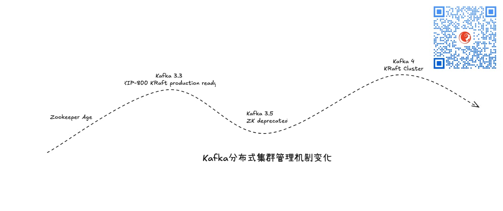

# Northguard 与 Xinfra

Linkedin通过InfoQ新发了一个技术公关稿，https://www.infoq.com/news/2025/06/linkedin-northguard-xinfra， 介绍了自己家新搞的消息中间件Northguard以及相关基础设施Xinfra

感觉是重新发明一次Kafka。

比较神奇的是，Kafka原本也是Linkedin团队出的，后来才捐给Apache基金会开源。

其实Kafka生态已经很成功了，但Linkedin在文章里说，现在的Kafka集群规模对他们来说已经有很大的管理负担：

> According to LinkedIn's engineers, Kafka had become increasingly difficult to manage at LinkedIn's scale (32T records/day, 17 PB/day, 400K topics, 150 clusters).

也就是**每天**有32万亿条记录 以及 17PB数据进来，总体上有150个集群和40万个topic。

当然，到底是不是因为这个原因导致他们要新搞一个Northguard我们就不知道了。

Northguard整体看下来，个人没有看到太多亮眼的东西，尤其是不能跟Kafka刚出来的时候比，当时我看到它在软硬结合与IO优化层面的工程实践，惊呼牛逼。

Northguard打算不使用Kafka打集中式集群管理方式，采用去中心化的一致性协议来管理集群。

当然， Kafka在新版本中也早就不是过去集中式的集群管理方案了，而是采用新的KRaft方案，其实也是去中心化一致性协议方式管理集群。

Northguard新引入的逻辑概念其实也没有什么新意，在Kafka和Pulsar里也有类似的对应，比如：

1. Record 其实就是对应单条消息
2. Segment，由多个Record组成， 其实就是对应单个数据文件或者BookKeeper里的segment
3. Range，由多个Segment组成，其实就是对应Bookeeper里的ledger
4. Topic，这个在各个消息中间件里都一样

唯一的一个差异可能就是，Northguard是在Segment粒度做集群节点内的sharding和负载均衡， 而Kafka里是Partition粒度， Pulsar则是Topic粒度。

/filters:no_upscale()/news/2025/06/linkedin-northguard-xinfra/en/resources/1LinkedIn-Northguard-Segment-Balancing-1750758765365.png)

Xinfra 其实就是 X + Infrastructure 的缩写，它存在的目的其实就是一个前置服务接入层。

当linkedin内部有Kafka和Northguard两套消息中间件之后，为了向消息客户端屏蔽两种消息中间件的差异，自然而然就会引入这么一个路由层。

引入Xinfra的好处就是，服务器端可以根据情况做消息路由和Kafka集群与Northguard集群的切换，而这些动作都对客户端透明，客户端完全不受影响。

假如你之前了解过微服务的设计模式(Design Patterns)，那么，一定听说过绞杀者模式，即Strangler Pattern，而实际上， Xinfra存在的目的，其实就是服务于绞杀者模式的场景，当然，这只是个人臆测，不一定对🤪

暂时无论是 Northguard 还是 Xinfra 还都没有开源，只是Linkedin声称自己公司内部在用，所以，具体后续会怎么样我们还不清楚，让我们一起拭目以待吧！

