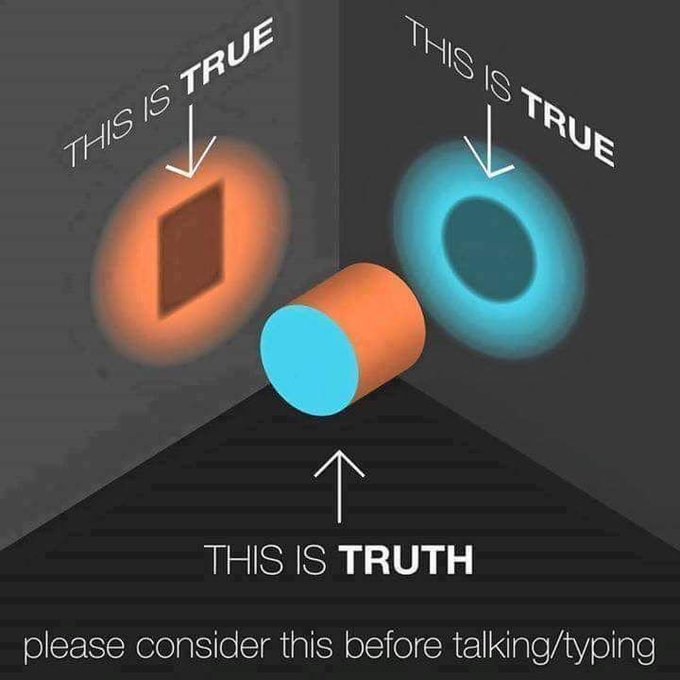
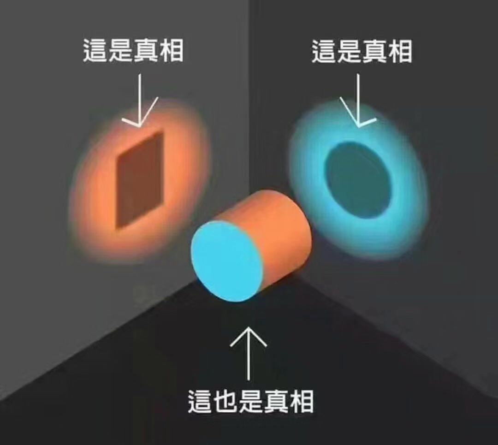

大家可能对架构师这个词儿并不陌生，但是否真正的理解这个词儿背后到底意味着什么，则有待商榷。

今天有个群里有 CEO 在讨论架构师这个职位，发现即使是 CEO 这个级别，大家对架构师这个词儿还是有很多误解，所以简单谈谈自己的看法。

其实，大家在媒体上看到的有关架构师的信息也不能说是错的，其实都算是 True， 包括群里 CEO 的观点也是算是 True，但大多不牵扯 Truth。 而 True 跟 Truth 其实是不一样的东西：

假如你看到的是中文版的这个图片，那么，“恭喜你“，可能你被误导了， 不管是翻译者有意为之还是TA自己的理解原本就有偏差。

Truth 是本源，truth可以投射出很多表象，这些表象是真的（true），但它们并不代表 Truth。

假如你关心有关架构师的 Truth 是什么，那么，read on...

## 角色

很多公司都有将架构师作为一个职位来招聘，这当然没有问题。

但架构师其实更多是一个角色（Role）而不是职位（Position）。

架构师其实本质上属于设计师，当然，这里的设计师是泛化的概念，并非简单的像平面设计师、UI 设计师这类职位，而是说，它的职能是“设计”，注意，不要快速地读“设计”这两个字，尝试用更慢地速度来度“设～计～”这两个字。

架构师也好，设计师也罢，本质上干的是思考、策划、规划、设计这些事情， 总之就是动脑子多些，你也可以用“谋”这个字儿来理解它的职能， 参谋、师爷，也都算架构师一类的角色。

只不过，同样是架构师，他们之间还是会划分类型的。

## 类型

架构师根据他们专注的领域，可以划分为两大类：

- 谋事的架构师
- 谋人的架构师

我们日常经常听到什么系统架构师啦、业务架构师啦、技术架构师啦，这些其实都是谋事的架构师，他们负责具体事情的规划和推动落地。

谋人的架构师是指的更多是团队的 leader 啦，部门的管理者啦，公司的各种 O 啦，甚至上升到国家粒度，我们经常说邓小平是改革开放的总设计师，其实也就是国家层面的首席架构师，但更多还是通过谋人来谋事。 总之，这类架构师更多偏组织管理和人层面的架构与规划，甚至人和事一起抓，类似政教合一的体制。

## 粒度

前面我们说，架构师不单单只限于团队和公司粒度，国家粒度，联盟粒度，将来星际之间的组织粒度甚至技术基础设施的规划和建设，其实都会有不同人来承担不同场景与粒度下的架构师的角色。

只不过，日常我们可能更关注团队内部的架构师角色罢了。

## 小结

本文从“角色”、“类型”和“粒度”三个视角（perspectives）帮助大家更立体地理解架构师这个词儿到底是什么意思，希望能让架构师在大家的脑海里更加立体和生动形象。

如果你喜欢视频形式，也欢迎关注 扶墙老师的视频号 或者 [youtube 频道](https://www.youtube.com/@afoo)。

