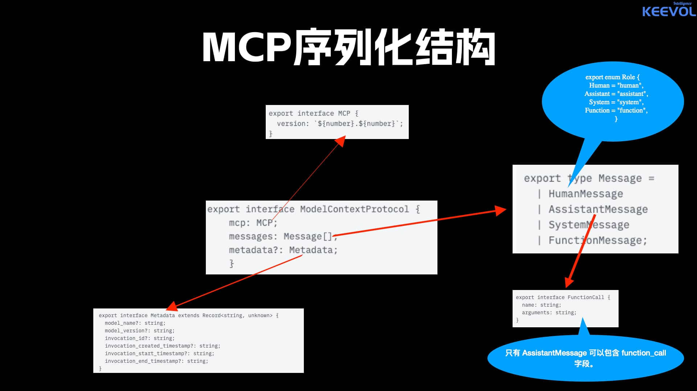
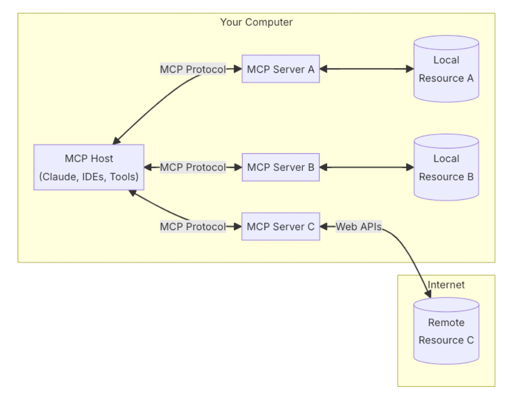
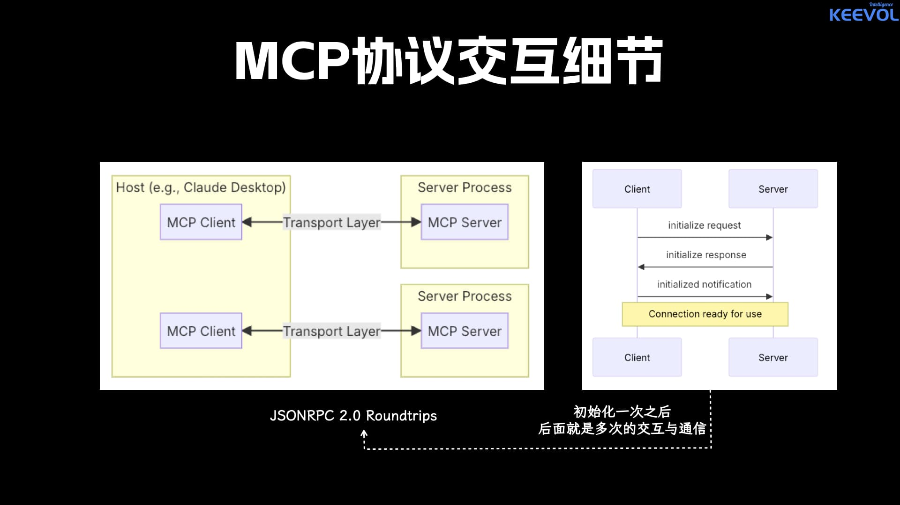
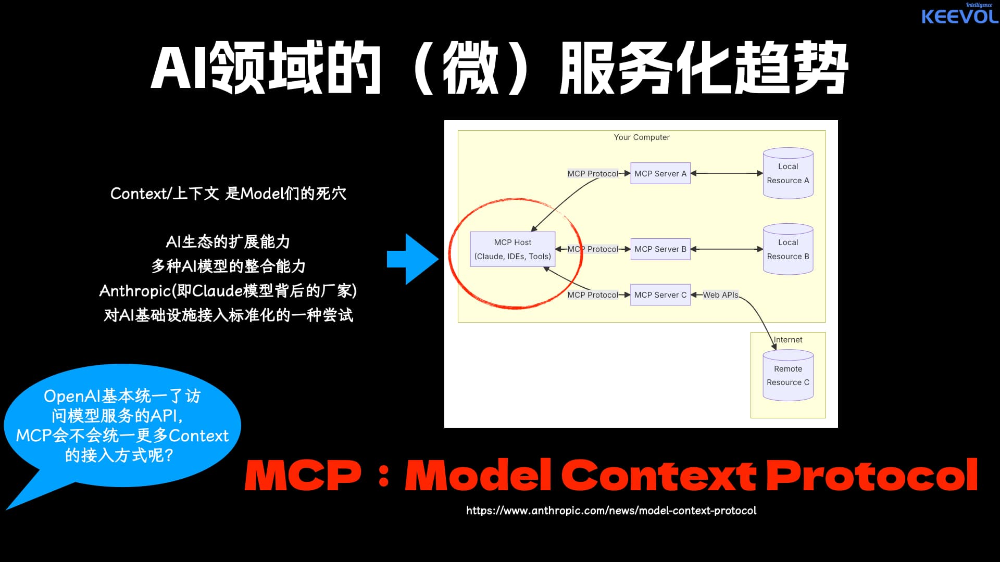

MCP全称是Model Context Protocol， 也就是"模型上下文协议"， 是Anthropic这家公司搞的一个AI应用协议。这个东西服务于AI应用（而不是AI模型），之所以强调这个，是因为很多人分不清楚大语言模型与大语言模型应用的差别。

那AI应用为什么需要MCP呢？

大部分大语言模型都是提供公开的信息给用户，但很大一部分信息其实是在“水面”下的，比如企业的私有知识库、个人的私有笔记等等，假如想要大语言模型根据这些信息给我们提供准确的信息，就必须告诉它这些信息，但很显然，过去这些信息搞成私有是有原因的。

那么如何解决AI应用获取这些私有信息并作为上下文使用的问题呢？

MCP就是出来干这个事儿的。 

它可以将各种类型的信息源（一般称为Resource）通过统一的MCP协议接入到AI应用，然后AI应用就可以根据这些特有信息做生成和回复了。

如果你熟悉过去的服务调用框架，那么简单来说MCP就像是一个AI版的DUBBO

MCP通过JSONRPC的调用方式来访问各种资源， 格式定义采用JSON Schema,大体上的结构是这个样子：

当然，这个只是告诉我们信息是以什么格式传递的（也就是wire format），但没有告诉我们MCP是如何与AI应用程序协作发挥跟大家作用的。

MCP的整个架构如下：

MCP Server就是一个Endpoint, 可以为不同的Resource（其实就是数据源）提供相应的MCP Server供AI应用访问， 而AI应用就是像Claude Desktop、Cody、Zed、Cursor这类工具或者客户端应用。

需要注意的是， MCP是在AI应用与数据源之间搭建桥梁， 而不是直接在AI模型与数据源之间搭建桥梁。（再次强调）

AI应用通过MCP获取数据源的数据再喂给AI模型， 从而形成一个AI应用的整体工作流程。

AI应用可以两种方式接入MCP服务：

1. 本地进程间通信，也就是MCP所称的stdio方式，像Anthropic自己家出的Claude Desktop应用，暂时就是只支持这种方式接入MCP服务；
2. 远程基于HTTP协议的通信接入，整个更通用，但是否支持，看具体的AI应用端实现。

每个AI应用接入MCP后的交互是这样的：

基本上就是连接确认后，后面多次交互。

当然， MCP还提供了prompts和tools等资源和工具等接入，整个感兴趣的同学可以去官网看看 🤣

最后，就跟我在给中国电信全国CIO班做企业培训的时候提到的一样，MCP后面有可能成为AI届微服务的扛把子，所以，值得大家关注下（当然，也只是可能，哈哈哈，能不能普及，也看有多少人愿意扑进来一起玩）

> TIP
>
> 至于开发，so easy啦，让cursor这些帮你干就行了，现在早就不用自己动手搞这种初级编码了，不是吗？😉

