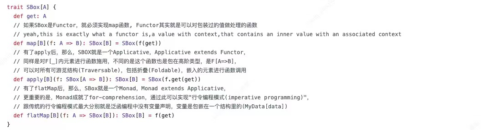

# Monads

虽然我们可以通过常见的理论来讲解什么 functor/applicative/monads，不过我不打算这么做，我只想通过简单的拆解，让大家理解这些概念的本质是怎么回事，而不管它们如何分类以及具体细节上有何差异，比如下图是网上的一个截图：

其实 monads相关的这些概念无非就围绕着两个核心概念展开：

1. 状态
2. 计算

所有 Monads（以下都如此称呼，同时包含了 functor/applicative 这些相关概念）的操作起点都是数据状态，而且是封装在数据容器中的数据状态（俗称盒子中的数据），Monads 存在的目的就是针对这些数据容器中的数据进行操作，而操作逻辑则通过提交的函数来定义。

对于状态的封装盒子来说，可以分成两类：

1. 一类是这个数据盒子就两种状态，要么有数据，要么没数据，有数据也只是包含一个数据，在 Scala 中，这种数据盒子类型最常见的就是 Option，在 Spring Reative 这个框架中叫 Mono；
2. 另一类是这个数据盒子可以包含 0 到 N 个数据，也就是我们俗称的集合（Collection）， 在 Spring Reative 框架中 Flux 就属于这类；

对于封装处理逻辑的函数来说，我们也可以简单划分为两类：

1. 函数的参数和返回结果类型都是“盒子”中数据，也就是没有封装到“盒子”里；
2. 函数的参数或者返回结果有一个封装为了“盒子”类型，或者参数和范围结果两者都封装为了“盒子”类型； 对于这种情况，为了避免频繁的嵌套和解包，一般会定义 flatMap 操作，flatMap 的作用就是把所有盒子的盒子中的数据都展开成一层，而不是盒子套盒子。 （而且，flatMap 这个名字我觉得起的也不好，其实它的操作是先 map 然后再 flatten，跟名字是反过来的）

所以，你看，这东西其实没有那么复杂，无非就是自找麻烦，给数据套个盒子，给函数的参数或者返回结果套个盒子，从个人角度来说，没啥 p 用，唯一的好处可能就是让代码风格统一化好看点儿。😉

如果你习惯看视频，可以参考这里的讲解： [https://youtu.be/8MgG07ZvH2I](https://youtu.be/8MgG07ZvH2I)

